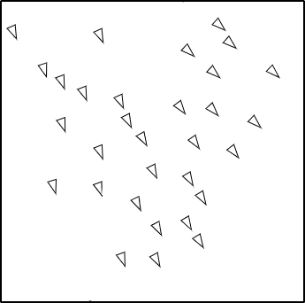

<!-- <link href="https://raw.githubusercontent.com/jasonm23/markdown-css-themes/gh-pages/avenir-white.css" rel="stylesheet" /> -->

# Boids!

[what are boids?](https://cs.stanford.edu/people/eroberts/courses/soco/projects/2008-09/modeling-natural-systems/boids.html)

[pseudo-code example](https://vergenet.net/~conrad/boids/pseudocode.html)

## Todo
- [ ] optimize
  - [x] ~~put all looping over boids in 1 pass~~
  - [ ] double check that I'm still doing math correctly
- [ ] add sliders to change relative application of each rule
- [ ] add sliders to change radii of 
- [ ] add buttons to pause/play
- [ ] when paused, user can click on a specific boid, in order to turn on "debug mode" for it.

<!-- (setq markdown-css-paths '("./readme-style.css")) -->

<!--  -->